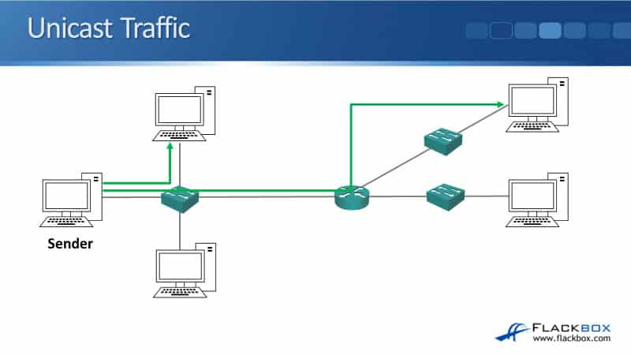
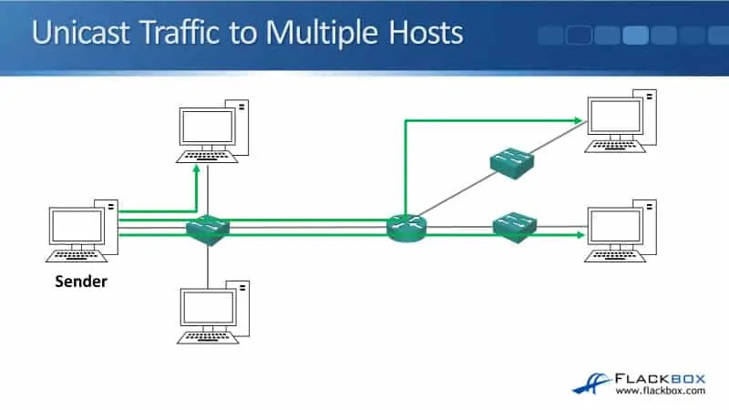
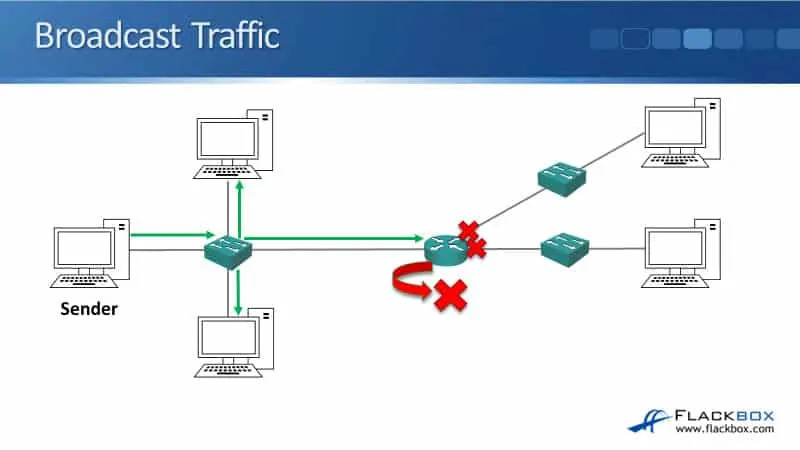
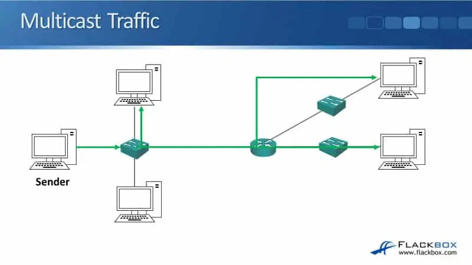

# Network Layer

## Table Of Contents
- [The IP Header](#1-the-ip-header)
- [Traffic Types](#2-traffic-types)
- [Decimal to Binary Conversion](#3-decimal-to-binary-conversion)
- [IPv4 Address Format](#4-ipv4-address-format)
- [IPv4 Address in Binary](#5-ipv4-address-in-binary)
- [Subnet Masks](#6-subnet-masks)
- [CIDR Slash Notation](#7-cidr-slash-notation)

---

# 1. The IP Header

## Overview

This lecture introduces **Layer 3 (Network Layer)** of the OSI Model and explains how IP addressing enables communication between different networks.

The lecture also introduces the IPv4 header and explains the purpose of each important field.

---

## Layer 3 Responsibilities

The Network Layer is responsible for:

* Routing packets between different networks.
* Providing logical addressing through IP addresses.
* Supporting Quality of Service (QoS).
* Dividing large networks into smaller subnets.

Unlike TCP, IP is **connectionless**, meaning it does not guarantee packet delivery or acknowledgements.

Reliability is handled by upper-layer protocols such as TCP.

---

## Common Layer 3 Protocols

| Protocol | Purpose                            |
| -------- | ---------------------------------- |
| IPv4     | Logical addressing and routing     |
| IPv6     | Next-generation IP addressing      |
| ICMP     | Network diagnostics (e.g., `ping`) |
| IPsec    | Secure encrypted communication     |

---

## Why Use Subnets?

Instead of placing every device inside one large network, IP addressing allows the network to be divided into **subnets**.

Benefits include:

* Better network performance.
* Improved security through logical separation.
* Easier troubleshooting.
* Simpler access control.

Example:

* Accounting servers can be placed on their own subnet.
* Only authorized users are allowed to access that subnet.

---

## Layer 2 vs Layer 3 Addressing

|   Layer | Address Type | Device |
| ------: | ------------ | ------ |
| Layer 3 | IP Address   | Router |
| Layer 2 | MAC Address  | Switch |

Key difference:

* **IP Address** is a **logical address** and can change depending on the network.
* **MAC Address** is a hardware address assigned to the network interface.

---

## OSI Review

Packet encapsulation follows the OSI Model:

```text
Application
↓

Presentation
↓

Session
↓

Transport
    • TCP / UDP
    • Port Numbers
↓

Network
    • Source IP
    • Destination IP
↓

Data Link
    • Source MAC
    • Destination MAC
↓

Physical
```

Network devices by layer:

|   Layer | Device       |
| ------: | ------------ |
| Layer 3 | Router       |
| Layer 2 | Switch       |
| Layer 1 | Hub (legacy) |

---

## IPv4 Header

The IPv4 header contains information required to deliver packets across networks.

Important fields include:

| Field                  | Purpose                               |
| ---------------------- | ------------------------------------- |
| Version                | Indicates IPv4 or IPv6                |
| Header Length          | Length of the IP header               |
| Type of Service (QoS)  | Traffic priority                      |
| Total Length           | Total packet size                     |
| Fragmentation Fields   | Track fragmented packets              |
| TTL (Time To Live)     | Prevent routing loops                 |
| Protocol               | Identifies Layer 4 protocol (TCP/UDP) |
| Header Checksum        | Detect header corruption              |
| Source IP Address      | Sender's IP address                   |
| Destination IP Address | Receiver's IP address                 |
| Options                | Optional additional information       |
| Data                   | Encapsulated payload                  |

---

## Time To Live (TTL)

Every router decreases the TTL value by **1**.

If TTL reaches **0**, the router discards the packet.

Purpose:

* Prevent packets from looping forever because of routing errors.
* Reduce unnecessary network traffic.

---

## Fragmentation

Different network technologies have different **Maximum Transmission Unit (MTU)** values.

Example:

* Ethernet default MTU = **1500 bytes**

If a packet exceeds the MTU, it is divided into multiple **fragments** before transmission.

The fragmentation fields in the IP header allow the receiving host to reconstruct the original packet.

---

## My Takeaways

* Layer 3 is responsible for logical addressing and routing between networks.
* IP itself is connectionless; reliable communication is provided by TCP.
* Subnetting improves performance, security, and network management.
* Routers forward packets using IP addresses, while switches forward frames using MAC addresses.
* TTL is a simple but effective mechanism for preventing routing loops.
* Understanding the IPv4 header is essential before learning routing, subnetting, and packet analysis.

---

# 2. Traffic Types

## Overview

This lecture introduces the three primary traffic delivery methods used in IP networks:

* Unicast
* Broadcast
* Multicast

Each traffic type serves a different purpose depending on how many destination devices should receive the data.

---

## Unicast

Unicast communication sends data from one sender to one specific destination.

Characteristics:

* One sender
* One receiver
* Most common traffic type on modern networks

Examples:

* Opening a website
* SSH connection
* Downloading a file
* API communication

Diagram : 




---

## Broadcast

Broadcast communication sends one packet to **every host within the same subnet**.

Characteristics:

* One sender
* All devices on the local network receive the packet
* Routers do **not** forward broadcast traffic

Reason:

Limiting broadcast traffic to a single subnet helps improve performance and prevents unnecessary traffic from spreading across larger networks such as the Internet.

Diagram : 



---

## Multicast

Multicast sends **one copy of data** to **multiple subscribed receivers**.

Unlike broadcast, only devices that have joined the multicast group receive the traffic.

Benefits:

* Saves bandwidth
* Reduces duplicate traffic
* More efficient than sending multiple unicast streams

Example:

A server streaming a live video to multiple users.

Instead of transmitting three separate streams, the server sends one multicast stream that is delivered only to interested receivers.

Diagram : 



---

## Traffic Comparison

| Traffic Type | Destination           | Router Forwarding   | Typical Use                        |
| ------------ | --------------------- | ------------------- | ---------------------------------- |
| Unicast      | One host              | Yes                 | Web browsing, SSH, Email           |
| Broadcast    | All hosts on a subnet | No                  | ARP, DHCP Discover                 |
| Multicast    | Selected hosts        | Yes (if configured) | IPTV, Video Streaming, Live Events |

---

## Key Concept

Broadcast and multicast may appear similar because both deliver data to multiple devices.

The main difference is:

* **Broadcast** reaches every device on the subnet.
* **Multicast** reaches only devices that explicitly join the multicast group.

This makes multicast much more bandwidth-efficient for one-to-many communication.

---

## My Takeaways

* Unicast is the default communication model used by most applications.
* Broadcast is limited to a single subnet because routers intentionally stop broadcast traffic.
* Multicast reduces bandwidth usage by sending one stream to multiple subscribed receivers.
* Choosing the appropriate traffic type is important for network efficiency and scalability.

---

# 3. Decimal to Binary Conversion

## Overview

Although IP addresses are commonly written in **decimal notation**, computers process them in **binary**.

Understanding binary is essential because IPv4 addresses, subnet masks, and subnetting calculations are all based on binary values.

---

## Decimal vs Binary

Humans naturally count using the **decimal (base-10)** number system.

Decimal digits:

```text
0 1 2 3 4 5 6 7 8 9
```

Each column increases by a factor of **10**.

| 1000 | 100 | 10 |  1 |
| ---: | --: | -: | -: |

Computers, however, use the **binary (base-2)** number system.

Binary digits:

```text
0 1
```

Each column increases by a factor of **2**.

| 128 | 64 | 32 | 16 |  8 |  4 |  2 |  1 |
| --: | -: | -: | -: | -: | -: | -: | -: |

---

## Binary Conversion Process

The conversion follows a simple rule:

Starting from the largest value, ask:

> **Can this value fit into the remaining decimal number?**

* Yes → Write **1** and subtract the value.
* No → Write **0** and move to the next column.

Continue until reaching the last column (1).

---

### Example 1 — Convert 236 to Binary

```text
Decimal = 236

128 ✓   Remaining = 108
 64 ✓   Remaining = 44
 32 ✓   Remaining = 12
 16 ✗
  8 ✓   Remaining = 4
  4 ✓   Remaining = 0
  2 ✗
  1 ✗
```

Result:

```text
236 = 11101100₂
```

Verification:

```text
128 + 64 + 32 + 8 + 4

= 236 ✓
```

---

### Example 2 — Convert 179 to Binary

```text
Decimal = 179

128 ✓   Remaining = 51
 64 ✗
 32 ✓   Remaining = 19
 16 ✓   Remaining = 3
  8 ✗
  4 ✗
  2 ✓   Remaining = 1
  1 ✓   Remaining = 0
```

Result:

```text
179 = 10110011₂
```

Verification:

```text
128 + 32 + 16 + 2 + 1

= 179 ✓
```

---

## Quick Reference
[!TIP]

| Decimal | Binary   |
| ------: | :------- |
|       1 | 00000001 |
|       2 | 00000010 |
|       4 | 00000100 |
|       8 | 00001000 |
|      16 | 00010000 |
|      32 | 00100000 |
|      64 | 01000000 |
|     128 | 10000000 |

Memorizing these eight values makes subnetting much easier later.

---

## Tips

When converting decimal to binary:

1. Always start from the **largest binary value**.
2. Subtract the value whenever possible.
3. Continue until the remaining value becomes **0**.
4. Verify the answer by adding every column that contains **1**.

---

## Why This Matters

Binary conversion is one of the most important prerequisites for:

* IPv4 Addressing
* CIDR Notation
* Subnet Masks
* Subnetting
* Route Summarization

A solid understanding of binary makes subnetting much easier to understand.

---

## My Takeaways

* Computers interpret IP addresses in binary, even though humans write them in decimal.
* Binary uses only two digits (0 and 1), with each column representing a power of two.
* Converting decimal to binary follows a simple "fit or not fit" approach.
* Checking the result by adding all active bit values helps verify the conversion.
* Memorizing the values **128, 64, 32, 16, 8, 4, 2, 1** will significantly speed up subnetting calculations.

---

# 4. IPv4 Address Format

## Overview

IPv4 addresses are represented in **dotted decimal notation**, consisting of four decimal numbers separated by periods.

Each number is called an **octet**, and each octet contains **8 bits**, resulting in a total IPv4 address length of **32 bits**.

Example:

```text
192.168.10.15
```

| Octet 1 | Octet 2 | Octet 3 | Octet 4 |
| ------: | ------: | ------: | ------: |
|     192 |     168 |      10 |      15 |

---

## IPv4 Address Structure

Each IPv4 address consists of:

```text
8 bits   8 bits   8 bits   8 bits

[ Octet ][ Octet ][ Octet ][ Octet ]
```

Total:

```text
8 × 4 = 32 bits
```

Each octet can represent values from:

```text
0 - 255
```

because:

```text
11111111₂ = 255₁₀
```

---

## Binary Representation

Although humans write IP addresses in decimal form, computers process them in binary.

Example:

```text
Decimal

192.168.10.15
```

becomes

```text
Binary

11000000.10101000.00001010.00001111
```

Understanding this binary representation is essential for learning:

* Subnet Masks
* CIDR
* Subnetting
* Routing

---

## Finding Your IP Address

Different operating systems provide different commands to display network configuration.

| Platform  | Command                                                   |
| --------- | --------------------------------------------------------- |
| Windows   | `ipconfig`                                                |
| Linux     | `ifconfig` *(or `ip addr` on modern Linux distributions)* |
| Cisco IOS | `show ip interface brief`                                 |

Useful Cisco commands:

```bash
show ip interface brief
show interface
show ip interface
```

These commands display information such as:

* IP Address
* Interface Status
* Subnet Mask / Prefix Length

---

## Default Gateway

The **default gateway** is the router used when a device needs to communicate with a different network.

Simple example:

```text
PC
IP Address:
192.168.1.9

↓

Default Gateway
192.168.1.1

↓

Other Networks / Internet
```

Communication flow:

* Same subnet → communicate directly.
* Different subnet → send traffic to the default gateway.

---

## Static vs Dynamic IP Addressing

### Static Address

IP address is configured manually.

Commonly used for:

* Servers
* Routers
* Switches
* Firewalls
* Printers

Advantages:

* Predictable
* Never changes unless manually modified
* Easy to reference for infrastructure devices

---

### Dynamic Address (DHCP)

IP address is assigned automatically by a **DHCP (Dynamic Host Configuration Protocol)** server.

Commonly used for:

* Desktop computers
* Laptops
* Mobile devices

Advantages:

* Centralized management
* Easier deployment
* Reduces manual configuration
* Minimizes configuration errors

---

## Static vs DHCP

| Static IP                  | DHCP                   |
| -------------------------- | ---------------------- |
| Manually assigned          | Automatically assigned |
| Fixed address              | Address may change     |
| Infrastructure devices     | End-user devices       |
| Requires manual management | Managed centrally      |

---

## Key Concept

A device decides where to send traffic based on the destination IP address.

```text
Destination

Same Subnet
        │
        ▼
Send Directly

Different Subnet
        │
        ▼
Send to Default Gateway
```

This decision-making process is fundamental to how IP routing works.

---

## My Takeaways

* Every IPv4 address consists of **32 bits**, divided into four 8-bit octets.
* Although IPv4 addresses are written in decimal notation, computers interpret them in binary.
* The default gateway allows communication with devices located on different networks.
* Infrastructure devices typically use static IP addresses, while client devices commonly obtain addresses through DHCP.
* Understanding IPv4 formatting and binary representation is essential before learning subnet masks and subnetting.

---

# 5. IPv4 Address in Binary

## Overview

Although IPv4 addresses are written in **dotted decimal notation**, every octet is stored and processed internally in **binary**.

Since each octet contains **8 bits**, the possible decimal value of one octet ranges from **0 to 255**.

---

## Why Does an Octet Range from 0 to 255?

Each octet contains 8 bits.

```text
Bit Position

128   64   32   16    8    4    2    1
```

Possible values:

Lowest value

```text
00000000
```

```
= 0
```

Highest value

```text
11111111
```

```
128 + 64 + 32 + 16 + 8 + 4 + 2 + 1

= 255
```

Therefore:

```text
Each IPv4 octet ranges from 0–255.
```

---

## Converting an IPv4 Address to Binary

Example IPv4 address:

```text
192.168.10.15
```

Convert **each octet independently**.

---

### Octet 1

Decimal:

```text
192
```

Calculation:

```text
128 ✓
 64 ✓
 32 ✗
 16 ✗
  8 ✗
  4 ✗
  2 ✗
  1 ✗
```

Binary:

```text
11000000
```

Verification:

```text
128 + 64 = 192
```

---

### Octet 2

Decimal:

```text
168
```

Calculation:

```text
128 ✓
 64 ✗
 32 ✓
 16 ✗
  8 ✓
  4 ✗
  2 ✗
  1 ✗
```

Binary:

```text
10101000
```

Verification:

```text
128 + 32 + 8 = 168
```

---

### Octet 3

Decimal:

```text
10
```

Calculation:

```text
128 ✗
 64 ✗
 32 ✗
 16 ✗
  8 ✓
  4 ✗
  2 ✓
  1 ✗
```

Binary:

```text
00001010
```

Verification:

```text
8 + 2 = 10
```

---

### Octet 4

Decimal:

```text
15
```

Calculation:

```text
128 ✗
 64 ✗
 32 ✗
 16 ✗
  8 ✓
  4 ✓
  2 ✓
  1 ✓
```

Binary:

```text
00001111
```

Verification:

```text
8 + 4 + 2 + 1 = 15
```

---

## Complete Conversion

```text
Decimal

192.168.10.15
```

↓

```text
Binary

11000000.10101000.00001010.00001111
```

Each decimal octet is converted independently into its 8-bit binary representation.

---

## Conversion Workflow

```text
Decimal Octet

↓

Write Binary Values

128 64 32 16 8 4 2 1

↓

Check from Left to Right

Can the value fit?

↓

Yes → Write 1

No → Write 0

↓

Subtract Remaining Value

↓

Repeat Until Remaining = 0

↓

Verify by Adding All Active Bits
```

---

## Tips

* Always evaluate values from **128 → 1**.
* Convert one octet at a time.
* Every octet must contain **exactly 8 bits**.
* Always verify the result by summing all active bit values.

---

## Why This Matters

Binary conversion is the foundation for:

* Subnet Masks
* CIDR Notation
* Network & Host Identification
* Subnetting
* Route Summarization

Without understanding binary, subnetting calculations become much more difficult.

---

## My Takeaways

* Every IPv4 octet consists of exactly **8 bits**.
* One octet can represent decimal values from **0 to 255**.
* Each octet is converted independently into binary.
* The binary representation of an IP address is essential for understanding subnet masks and subnetting.
* Verifying the conversion by adding all active bit values helps ensure the calculation is correct.

# 6. Subnet Masks

## Overview

A subnet mask defines the boundary between the **network** and **host** portions of an IPv4 address. It enables devices to determine whether a destination is on the same subnet or a different subnet, allowing them to decide whether to send traffic directly or forward it to a router.

---

## Key Concepts

### Same Subnet vs Different Subnet

* Devices on the **same subnet** communicate directly through a switch.
* Devices on **different subnets** communicate through a router (default gateway).
* A host compares the destination IP address with its own subnet mask before forwarding traffic.

```text
Destination IP
      │
      ▼
Compare using Subnet Mask
      │
      ├── Same Network → Send directly
      └── Different Network → Send to Default Gateway
```

---

### Network and Host Portions

The subnet mask separates an IP address into two parts:

* **Network Portion** → Identifies the subnet.
* **Host Portion** → Identifies an individual device within that subnet.

Example:

```text
IP Address : 192.168.10.15
Subnet Mask: 255.255.255.0

Network Portion : 192.168.10
Host Portion    : .15
```

---

### Valid Subnet Mask

A valid subnet mask always consists of **contiguous 1s followed by contiguous 0s**.

Valid example:

```text
11111111.11111111.11111111.00000000
```

Invalid example:

```text
11101111.11111111.00000000.00000000
```

---

### Reserved Addresses

Two addresses in every subnet cannot be assigned to hosts.

| Address           | Purpose           |
| ----------------- | ----------------- |
| All host bits = 0 | Network Address   |
| All host bits = 1 | Broadcast Address |

Example (`192.168.10.0/24`):

| Address Range                 | Usage                 |
| ----------------------------- | --------------------- |
| 192.168.10.0                  | Network Address       |
| 192.168.10.1 – 192.168.10.254 | Usable Host Addresses |
| 192.168.10.255                | Broadcast Address     |

---

### Host Address Rules

* Every device on the same subnet must have a **unique IP address**.
* Host addresses do **not** need to be sequential.
* Duplicate IP addresses on the same subnet are not allowed.

---

## My Takeaways

* A subnet mask separates the network and host portions of an IPv4 address.
* Devices use the subnet mask to determine whether traffic is local or must be sent to a router.
* Communication within the same subnet is direct, while different subnets require a default gateway.
* Valid subnet masks always contain contiguous `1`s followed by contiguous `0`s.
* Network and Broadcast addresses are reserved and cannot be assigned to end devices.

# 7. CIDR Slash Notation

## Overview

CIDR (Classless Inter-Domain Routing) slash notation is a shorter and more convenient way to represent subnet masks. Instead of writing the full dotted decimal subnet mask, the number after the slash (`/`) indicates how many consecutive bits belong to the network portion.

---

## Key Concepts

### CIDR Slash Notation

A subnet mask can be written in two equivalent formats:

| Dotted Decimal | Slash Notation |
| -------------- | -------------- |
| 255.255.255.0  | /24            |
| 255.255.0.0    | /16            |
| 255.0.0.0      | /8             |

The value after the slash represents the number of contiguous `1`s in the subnet mask.

Example:

```text
255.255.255.0

11111111.11111111.11111111.00000000
<-----------24----------->

= /24
```

---

### Why Slash Notation?

CIDR notation is widely used because it is:

* Easier to read and write.
* Commonly used in network diagrams and documentation.
* More concise than dotted decimal notation.

For example:

```text
192.168.10.15/24
```

is equivalent to

```text
192.168.10.15
Subnet Mask: 255.255.255.0
```

---

### Determining the Network Address

The network address contains only the **network portion** of an IP address.

Example:

```text
Host Address : 10.10.10.15/8

Network Portion : 10
Host Portion    : 10.10.15

Network Address : 10.0.0.0/8
```

---

### Usable Host Range

For the network:

```text
10.0.0.0/8
```

| Address        | Purpose           |
| -------------- | ----------------- |
| 10.0.0.0       | Network Address   |
| 10.0.0.1       | First Usable Host |
| 10.255.255.254 | Last Usable Host  |
| 10.255.255.255 | Broadcast Address |

---

## My Takeaways

* CIDR slash notation is a simplified representation of subnet masks.
* The number after `/` indicates the number of network bits.
* Slash notation is commonly used in network documentation because it is concise and easier to read.
* The network address includes only the network portion of an IP address, while the remaining bits identify individual hosts.
* Understanding CIDR notation makes it easier to identify network boundaries and calculate usable host ranges.

